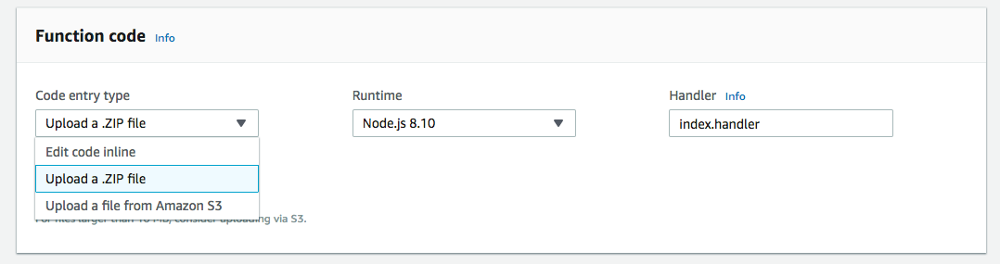
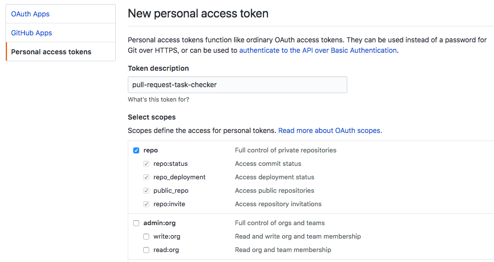

# pull-request-task-checker


## Usage

1. Generate posting file for AWS Lambda.

```
$ yarn install
$ yarn build
```

2. Create AWS Lambda project and upload Lambda.zip.



3. Create Github access token from `myAccount > Settings > Developer settings > Personal access tokens > Generate new token`. Check repo of Select scopes.



4. Set environment variable GITHUB_ACCESS_TOKEN.

5. Create webhook for applying Repository from `repository > Settings > Webhooks > Add webhook`. Check `Let me select individual events.` and `Pull requests`.


